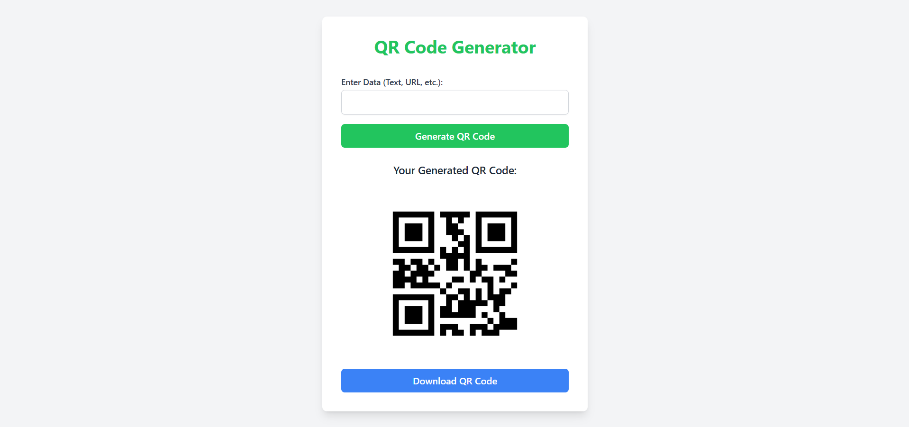

# QR Code Generator
This project is a QR Code Generator that allows users to enter text, URL, or other data to create a custom QR code. The generated QR code is displayed on the page, and users can download it with a simple click. The app uses Tailwind CSS, Bootstrap for a modern, responsive design.

